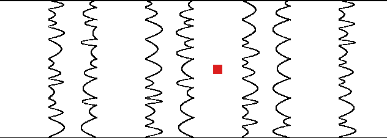
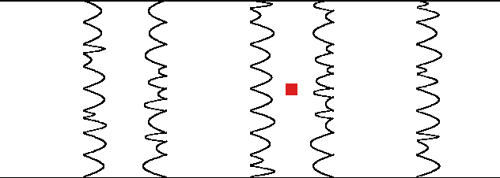
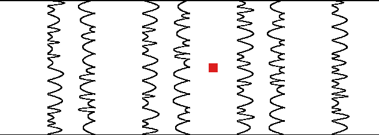
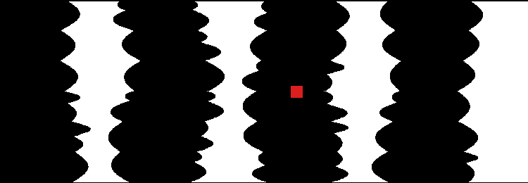
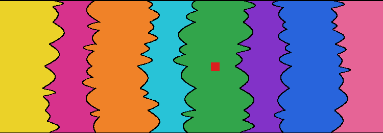
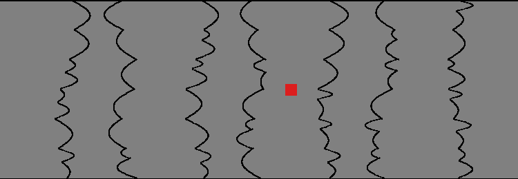

# Figure-Ground Perception Stimulus Generator

[](https://www.python.org/downloads/)
[](https://opensource.org/licenses/MIT)

A Python tool for generating visual **Figure-Ground Perception stimuli** based on visual cognition research by **Peterson & Salvagio (2008)** (*Inhibitory competition in figure-ground perception: Context and convexity*, Journal of Vision) and **Stevens & Brookes (1988)**.

This package generates articulated vertical wavy-edge displays with configurable lobe frequencies, alternating region counts, color palettes, open vs. closed top/bottom shape closure, probe square placement, and intra-region width variations.

---

## Table of Contents
- [Overview & Background](#overview--background)
- [Key Features](#key-features)
- [Installation](#installation)
- [Quick Start](#quick-start)
  - [Command Line Interface (CLI)](#command-line-interface-cli)
  - [Python API Usage](#python-api-usage)
- [Sample Stimuli & Research Conditions](#sample-stimuli--research-conditions)
  - [1. Outline Displays (Reference Matching)](#1-outline-displays-reference-matching)
  - [2. Binary Black & White Displays (Experiment 1)](#2-binary-black--white-displays-experiment-1)
  - [3. Multicolored Heterogeneous Displays (Experiment 2)](#3-multicolored-heterogeneous-displays-experiment-2)
  - [4. Homogeneous Displays (Experiment 3)](#4-homogeneous-displays-experiment-3)
  - [5. Closed Shapes with Top/Bottom Capping Splines](#5-closed-shapes-with-topbottom-capping-splines)
  - [6. Variable Region Base Widths](#6-variable-region-base-widths)
  - [7. Intra-Region Width Variation & Spine Wobble](#7-intra-region-width-variation--spine-wobble)
- [Parameter Reference Guide](#parameter-reference-guide)
- [Project Structure](#project-structure)
- [Citation & References](#citation--references)

---

## Overview & Background

Figure-ground organization is a fundamental process in visual perception. Visual cues such as **convexity**, **symmetry**, **small area**, and **enclosure** influence which side of a boundary is perceived as a shaped figure and which side is seen as an unshaped background ground.

**Peterson & Salvagio (2008)** demonstrated that:
1. **Context Effects / Concatenation Effects**: The bias to see convex regions as figures increases as the number of alternating convex/concave regions increases (from 2 to 8 regions).
2. **Homogeneity Requirement**: This context effect requires that the concave regions be homogeneously colored (e.g. all white or all gray); heterogeneity in convex regions does not diminish the effect.
3. **Inhibitory Competition**: Figure-ground perception involves cross-edge competition where suppressed low-weight candidate shapes (concave regions) undergo weight linkage and synergistic suppression when homogeneous.

This generator produces precise stimuli used to test figure-ground competition across single and multi-edge displays.

---

## Key Features

- **Parametric Lobe Geometry**: Smooth sinusoidal half-cycles (`sin(π·t)`) creating natural convex bulges.
- **Nested Secondary Sub-Lobes**: Probability-based sub-lobe generation (`sublobe_prob`), modeling primary and secondary convex parts.
- **Odd & Even Region Support**: Supports any region count (`num_regions`), including odd region counts required for standalone enclosed shapes.
- **Top/Bottom Shape Closure (`closure='closed'`)**: Curved capping splines (`make_cap_arc()`) connecting top/bottom boundaries to create standalone enclosed figures.
- **Inter- & Intra-Region Width Variability**:
  - `width_variability`: Varies overall column base widths across regions.
  - `spine_wobble`: Applies lateral sine drift along vertical $y$, varying width throughout a single region.
  - `amplitude_variability` & `lobe_height_variability`: Varies bulge size and vertical height per lobe.
- **Multiple Fill Modes**: `outline`, `binary` (black/white), `colored` (multicolored), and `homogeneous`.
- **Target Region Color Mapping**: Control whether custom color palettes apply to `'convex'` regions, `'concave'` regions, or `'both'`.
- **Probe Square Placement**: Position customizable fixation/probe squares (`probe_config`) on any region.

---

## Installation

### Prerequisites
- Python 3.8 or higher
- [Pillow (PIL)](https://python-pillow.org/)

### Setup
Clone the repository and install Pillow:

```bash
git clone https://github.com/your-username/Stimuli_Generation.git
cd Stimuli_Generation
pip install pillow
```

---

## Quick Start

### Command Line Interface (CLI)

Generate a standard 8-region outline stimulus with 7 lobes per edge and a red probe:

```bash
python3 stimulus_generator.py --num_regions 8 --num_lobes 7 --fill_mode outline --output my_stimulus.png
```

Generate a closed display with 7 regions, sub-lobes, and binary black/white fills:

```bash
python3 stimulus_generator.py --num_regions 7 --num_lobes 6 --closure closed --fill_mode binary --output closed_binary.png
```

### Python API Usage

```python
from stimulus_generator import FigureGroundGenerator

# Initialize generator with canvas dimensions
gen = FigureGroundGenerator(width=750, height=260, seed=42)

# Generate a multicolored stimulus image
img = gen.generate(
    num_regions=8,
    num_lobes=6,
    fill_mode='colored',
    convex_color_palette=['yellow', 'orange', 'green', 'blue'],
    concave_color_palette=['magenta', 'cyan', 'purple', 'pink'],
    sublobe_prob=0.5,
    probe_config={'enabled': True, 'region': 4, 'size': 16, 'color': 'red'},
    seed=42
)

# Save image
img.save("multicolored_stimulus.png")
```

---

## Sample Stimuli & Research Conditions

### 1. Outline Displays (Reference Matching)
White background displays bounded by alternating convex/concave edge outlines with a red probe square, matching the experimental stimuli in Peterson & Salvagio (2008).

| Condition | Image |
| :--- | :--- |
| **8 Regions (7 Lobes)** |  |
| **6 Regions (8 Lobes)** |  |
| **8 Regions (10 Lobes)** |  |

```bash
python3 stimulus_generator.py --num_regions 8 --num_lobes 7 --sublobe_prob 0.5 --output assets/match_ref1.png
```

---

### 2. Binary Black & White Displays (Experiment 1)
Alternating black (convex) and white (concave) region fills used to test concatenation effects across 2, 4, 6, and 8 regions.



```bash
python3 stimulus_generator.py --num_regions 8 --num_lobes 6 --fill_mode binary --output assets/exp1_binary_black_white.png
```

---

### 3. Multicolored Heterogeneous Displays (Experiment 2)
Displays where each region is painted a distinct color to test whether convexity effects persist when regions of the same type are heterogeneous.



```bash
python3 stimulus_generator.py --num_regions 8 --num_lobes 6 --fill_mode colored \
  --convex_palette yellow orange green blue \
  --concave_palette magenta cyan purple pink \
  --output assets/exp2_multicolored_heterogeneous.png
```

---

### 4. Homogeneous Displays (Experiment 3)
Displays where target regions (e.g. convex or concave) are homogeneously colored gray while intervening regions are painted heterogeneous contrasting colors.



```bash
python3 stimulus_generator.py --num_regions 8 --num_lobes 6 --fill_mode homogeneous \
  --target_part convex --convex_palette gray \
  --concave_palette yellow magenta cyan orange \
  --output assets/exp3a_homogeneous_convex.png
```

---

### 5. Closed Shapes with Top/Bottom Capping Splines
When `--closure closed` is specified, an odd number of regions (e.g., 7) is created, and the target convex regions are enclosed at top and bottom using matching smooth capping splines (`make_cap_arc()`), turning them into standalone closed figures.


```bash
python3 stimulus_generator.py --num_regions 7 --num_lobes 6 --closure closed --cap_amplitude 18.0 --output assets/test_closed_7regions.png
```

---

### 6. Variable Region Base Widths
Varies the overall base width of each region column across the canvas (`width_variability=0.35`).


```bash
python3 stimulus_generator.py --num_regions 8 --num_lobes 7 --width_variability 0.35 --output assets/test_var_width.png
```

---

### 7. Intra-Region Width Variation & Spine Wobble
Varies the width **throughout a single region** from top to bottom by applying lateral spine drift (`spine_wobble=15.0`), lobe amplitude variation (`amplitude_variability=0.4`), and vertical lobe height variation (`lobe_height_variability=0.3`).


```bash
python3 stimulus_generator.py --num_regions 8 --num_lobes 7 \
  --spine_wobble 15.0 \
  --amplitude_variability 0.4 \
  --lobe_height_variability 0.3 \
  --output assets/test_intra_region_wobble.png
```

---

## Parameter Reference Guide

| Parameter | CLI Flag | Type | Default | Description |
| :--- | :--- | :--- | :--- | :--- |
| `num_regions` | `--num_regions` | `int` | `8` (or `7`) | Total number of alternating vertical regions (`2`, `4`, `6`, `8`, etc.). Requires odd number for `closure='closed'`. |
| `num_lobes` | `--num_lobes` | `int` | `6` | Number of convex lobes / wave half-cycles per edge from top to bottom. |
| `fill_mode` | `--fill_mode` | `str` | `'outline'` | Region fill style: `'outline'`, `'binary'`, `'colored'`, or `'homogeneous'`. |
| `target_part` | `--target_part` | `str` | `'convex'` | Target region for palette assignment: `'convex'`, `'concave'`, or `'both'`. |
| `convex_color_palette` | `--convex_palette` | `list[str]` | `None` | Space-separated list of colors (names or hex codes) for convex regions. |
| `concave_color_palette` | `--concave_palette` | `list[str]` | `None` | Space-separated list of colors for concave regions. |
| `background_color` | — | `str/tuple` | `'white'` | Canvas background color. |
| `amplitude` | `--amplitude` | `float` | `22.0` | Peak lobe bulge height in pixels. |
| `sublobe_prob` | `--sublobe_prob` | `float` | `0.44` | Probability (`0.0` to `1.0`) that any lobe contains a nested secondary sub-lobe. |
| `width_variability` | `--width_variability` | `float` | `0.0` | Variance factor (`0.0` to `0.7`) for region base column widths across the canvas. |
| `spine_wobble` | `--spine_wobble` | `float` | `0.0` | Max pixel lateral drift of the edge spine along vertical $y$ (varies width within a single region). |
| `amplitude_variability` | `--amplitude_variability`| `float` | `0.2` | Variation factor for peak lobe amplitudes vertically along the edge. |
| `lobe_height_variability`| `--lobe_height_variability`| `float` | `0.0` | Variation factor for vertical lobe heights along the edge. |
| `closure` | `--closure` | `str` | `'open'` | `'open'` (standard horizontal frame lines) or `'closed'` (top/bottom capping splines on odd regions). |
| `cap_amplitude` | `--cap_amplitude` | `float` | `18.0` | Peak height in pixels of top/bottom capping splines when `closure='closed'`. |
| `probe_config` | `--probe_region` / `--no_probe` | `dict` | Enabled | Options for probe square: `{'enabled': True, 'region': 4, 'size': 16, 'color': 'red'}`. |
| `seed` | `--seed` | `int` | `42` | Random seed for reproducible stimulus generation. |
| `width` | `--width` | `int` | `750` | Total canvas width in pixels. |
| `height` | `--height` | `int` | `260` | Total canvas height in pixels. |
| `output` | `--output` | `str` | `'generated_stimulus.png'` | Filepath to save output image. |

---

## Project Structure

```
Stimuli_Generation/
├── stimulus_generator.py      # Core generator script with Python API & CLI
├── generate_batch_samples.py  # Utility script to generate sample image sets
├── assets/                    # Pre-generated sample PNG images for README
│   ├── match_ref1.png
│   ├── match_ref2.png
│   ├── match_ref3.png
│   ├── exp1_binary_black_white.png
│   ├── exp2_multicolored_heterogeneous.png
│   ├── exp3a_homogeneous_convex.png
│   ├── test_closed_7regions.png
│   ├── test_var_width.png
│   └── test_intra_region_wobble.png
└── README.md                  # Project documentation
```

---

## Citation & References

If you use this stimulus generator in your research, please cite:

1. **Peterson, M. A., & Salvagio, E. (2008).** Inhibitory competition in figure-ground perception: Context and convexity. *Journal of Vision*, 8(16):4, 1–13. [doi:10.1167/8.16.4](https://doi.org/10.1167/8.16.4)
2. **Stevens, K. A., & Brookes, A. (1988).** The concave cusp as a determiner of figure-ground. *Perception*, 17, 35–42.
